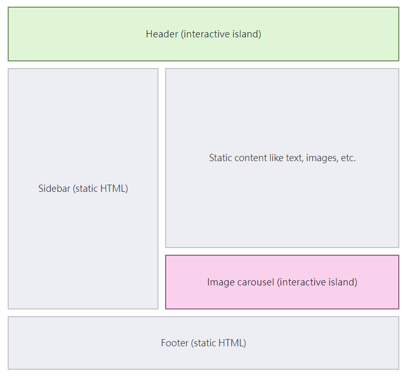

# Astro框架介紹
Astro 是一個現代前端框架，專注於構建靜態網站如部落格、產品介紹頁，提供零 JavaScript 加載的特性，並支持多種前端框架（如 React, Vue, Svelte, 等）的整合

### 專案建立
```
# create a new project with npm
npm create astro@latest

# create a new project with pnpm
pnpm create astro@latest

# create a new project with yarn
yarn create astro
```

### Astro組件
結構分別為程式碼、模板、樣式
Astro會將`---`包圍的部分裡所有的程式碼包含API調用在Server端全部執行完畢後帶入template裡
```
---
const message = "Hello, Astro!";
---

<div>
  <h1>{message}</h1>
  <p>This is a default Astro component structure.</p>
</div>

<style>
  div {
    background-color: #f0f0f0;
    padding: 1rem;
  }
  h1 {
    color: #333;
  }
</style>

```
> 從上方組件來看，Astro其實並不是完全沒有 JavaScript，畢竟 `const message = "Hello, Astro!"`就是一段程式碼
> 所謂的0 Javascript其實是指Astro會在伺服器端的編譯階段執行`---`內的程式碼後將結果渲染成靜態HTML，這樣客戶端就是純靜態了

### 孤島架構 Islands Architecture

在靜態HTML頁面裡面可交互的UI組件被稱為「Astro Island」
而因為每個island島嶼都是獨立且不會互相影響的關係所以可以在Astro內同時引入不同框架的組件進來使用
```
---
import VueCounter from '@components/vue/VueCounter.vue';
import ReactCounter from '@components/react/ReactCounter';
import SvelteCounter from '@components/svelte/SvelteCounter.svelte';
---
<main>
     <VueCounter />
     <ReactCounter />
     <SvelteCounter />
</main>
<style></style>
```

### 0 Javascript
還記得前面講所謂的0 Javascript是Astro在server端生成純靜態的HTML回傳嗎?
由於這個特性Astro也會將不同框架的組件內容通通處理成純HTML回傳,但這也導致組件內的程式邏輯無法運行
```
<!-- Counter.vue -->
<script setup>
import { ref, onMounted } from 'vue';

const count = ref(0);

const increment = () => {
    count.value++;
};

onMounted(() => {
    console.log("Counter 元件在客戶端被渲染");
});
</script>
<template>
    <div>
        <p>計數：{{ count }}</p>
        <button @click="increment">
            增加
        </button>
    </div>
</template>
```
用上面組件測試會發現只有UI顯示是正常的,按鈕點擊完全沒有反應
所以Astro提供了`client`的directives讓組件在client端再執行
```
---
import VueCounter from '@components/vue/VueCounter.vue';
import ReactCounter from '@components/react/ReactCounter';
import SvelteCounter from '@components/svelte/SvelteCounter.svelte';
---
<main>
     <VueCounter client:load />
     <ReactCounter client:load />
     <SvelteCounter client:load />
</main>
<style></style>
```
> `client:load`這個directive會讓組件在client端的時候才去載入javascript程式碼，其他還有像是`client:visible`、`client:only`等等的[Astro directives](https://docs.astro.build/zh-tw/reference/directives-reference/)有興趣的可以看一下

### 組件資料傳遞

**Props**
在 Astro 中，最常見的資料傳遞方式之一是使用 Props 這讓我們能從父組件傳遞資料到子組件

在子組件中，我們可以透過 Astro.props 來取得父組件傳入的資料
```
Layout.astro
---
interface Props {
  title: string;
}

const { title } = Astro.props;
---
<!doctype html>
<html lang="en">
<head>
    <title>{title}</title>
</head>
<body>
    <div>
        <slot />
    </div>
</body>
</html>
```

在父組件中，將資料傳入子組件作為屬性
```
demo.astro
---
import Layout from '@layouts/Layout.astro';
const title = 'Demo Page';
---

<Layout title={title}>
    <main>
        ...
    </main>
</Layout>
```
這樣，父組件透過 Props 傳入 title，並在子組件中使用 Astro.props 來接收並顯示。

**Store全域狀態管理**
Astro 並不像 Vue 或 React 內建全域狀態管理工具，但我們可以使用輕量級的 [Nano Stores](https://github.com/nanostores/nanostores) 來實現跨框架的狀態共享。

第一步:根據你使用的框架安裝對應的套件
```
npx astro add vue
npx astro add react
npm install nanostores @nanostores/vue
npm install nanostores @nanostores/react
```
第二步：定義全域狀態
在 stores 資料夾中建立一個 store.js 並定義一個全域狀態變數 isOpen：
```
import { atom } from 'nanostores';
export const isOpen = atom(false);
```
第三步:在不同框架的組件內使用Store
假設有一個Vue以及React的button組件,當使用者點擊時會去變更「isOpen」變數的狀態
VueButton.vue
```
<script setup>
import { useStore } from '@nanostores/vue';
import { isOpen } from '../../stores';

const isOpenValue = useStore(isOpen);

const toggle = () => {
    isOpen.set(!isOpenValue.value);
};
</script>

<template>
    <button @click="toggle">
        {{ isOpenValue ? 'Close Vue Dialog' : 'Open Vue Dialog' }}
    </button>
</template>
```
ReactButton.tsx
```
// src/components/ReactButton.tsx
import React from 'react';
import { useStore } from '@nanostores/react';
import { isOpen } from '../../stores';

const ReactButton: React.FC = () => {
    const isOpenValue = useStore(isOpen);

    return (
        <button onClick{()=>isOpen.set(!isOpenValue)}>
            {isOpenValue ? 'Close React Dialog' : 'Open React Dialog'}
        </button>
    );
};

export default ReactButton;

```
第四步：在 Astro 頁面中使用這些組件
在 Button.astro 文件中引入並使用這兩個組件，實現跨框架的狀態同步：
```
---
import Layout from '@layouts/Layout.astro';
import ReactButton from '@components/react/ReactButton';
import VueButton from '@components/vue/VueButton.vue';
const title = 'Button Astro';
---

<!-- store狀態管理 -->
<Layout title={title}>
    <main>
        <h1>{title}</h1>
        <section>
            <ReactButton client:load/>
            <VueButton client:load/>
        </section>
    </main>
</Layout>
<style></style>

```
當點擊 Vue 或 React 按鈕時，isOpen 狀態將會在這兩個框架中同步更新

**客製化事件**
可以透過自定義的事件在不同框架組件之間傳遞資訊這邊選擇使用Vue

1. 建立 Vue 組件：根據需求建立一個 Vue 組件來處理使用者的輸入
2. 註冊事件監聽：在組件內註冊 CustomEvent，用來捕捉特定的使用者操作
3. 觸發自定義事件：當條件滿足時（例如按下 Enter 且有輸入值），將自定義事件 dispatch 以傳遞資訊
4. 在其他要取得輸入的組件裡註冊 CustomEvent 的事件監聽

Input.vue
```
<script setup>

const searchEvent = new CustomEvent('search', {
  detail: { keyword: '' },
});

function dispatchSearchEvent(keyword) {
  searchEvent.detail.keyword = keyword;
  document.dispatchEvent(searchEvent);
}

function onKeyUp(event) {
  const keyword = event.target.value.trim().toLowerCase();

  if (event.key.toLowerCase() === 'enter') {
    dispatchSearchEvent(keyword);
  }
}
</script>

<template>
  <div>
    <input
      id="search"
      type="text"
      @keyup="onKeyUp"
      placeholder="Search..."
    />
  </div>
</template>
```
ReactSearchDisplay.tsx
```
import React, { useEffect, useState } from 'react';

const SearchDisplay: React.FC = () => {
  const [keyword, setKeyword] = useState<string>('');

  const handleSearchEvent = (event: Event) => {
    if (event instanceof CustomEvent) {
      const searchKeyword = event.detail?.keyword || '';
      setKeyword(searchKeyword);
    }
  };

  useEffect(() => {
    document.addEventListener('search', handleSearchEvent);

    return () => {
      document.removeEventListener('search', handleSearchEvent);
    };
  }, []);

  return (
    <div>
      <h2>Search Result:</h2>
      <p>{keyword ? keyword : 'No keyword entered'}</p>
    </div>
  );
};

export default ReactSearchDisplay;
```
在 Astro 組件裡面使用這些組件
```
---
import VueInput from '@components/vue/Input.vue';
import ReactSearchDisplay from '@components/react/ReactSearchDisplay';
const title = 'CustomEvent Page';
---
<main>
    <h1>CustomEvent Page</h1>
    <section>
        <VueInput client:load />
        <ReactSearchDisplay client:load />
    </section>
</main>
<style></style>
```
當 VueInput 輸入資訊時 ReactSearchDisplay 就會取得該輸入

### 渲染模式
Astro 預設支援靜態渲染 (SSG)，並且同時支援伺服器端渲染（SSR）和客戶端渲染（CSR）
在`astro.config.mjs` 進行SSR渲染設定，有以下設定模式

server mode
所有Astro組件預設都為SSR模式
```
export default defineConfig({
  output: 'server',
  adapter: xxx
});
```
hybrid mode
預設仍然是SSG模式，但可以在需要SSR的頁面單獨設定
```
export default defineConfig({
  output: 'hybrid',
  adapter: xxx
});
```
adapter為當你要在不同環境使用 SSR 渲染時需要額外載入套件 ex: nodejs、vercel、Netlify

CSR 渲染就如同之前的範例一樣加上`client:*` 關鍵字即可，另外，Astro 同時支援混合渲染（Hybrid Rendering），可以對特定組件啟用 (SSR)，而其他組件仍保持靜態生成（SSG）
補充：https://docs.astro.build/zh-tw/guides/server-side-rendering/

### 路由
Astro 與 Nuxt.js 等 SSR 框架相似，提供基於檔案路徑結構的路由功能（File-Based Routing）。在 src/pages/ 目錄下，Astro 支援以下檔案類型作為頁面或 API 端點：
* .astro
* .md
* .mdx (需安裝 MDX Integration)
* .html
* .js/.ts (作為 API 端點)

### SSG動態路由
Astro 預設為靜態網站生成（SSG，Static Site Generation），每個頁面會在打包時生成靜態 HTML 檔案。若需要在 SSG 模式下實現動態路由，需事先為所有可能的路徑定義 URL。

在 src/pages/ 目錄下，建立一個動態路由檔案 [dynamicRoute].astro：
```
---
// 使用 Astro.params 物件來存取 URL 中的動態參數
const { dynamicRoute } = Astro.params;

// getStaticPaths 函數，用來指定動態路由的路徑(函數名稱無法自定義)
export async function getStaticPaths() {

    // 動態路徑的數據
    const routes = ['page1', 'page2', 'page3'];
    
    // 返回包含每個路徑參數的Array
    return routes.map((route) => ({
        params: { dynamicRoute: route },
    }));
}
---
<main>
    <h1>動態路由頁面</h1>
    <div>
        <p>動態路由參數: {dynamicRoute}</p>
    </div>
</main>
```
動態路由的定義方式與其他框架相似，通過在檔案名稱中使用方括號 [] 包住 URL 參數名稱（如 [dynamicRoute].astro）來捕獲動態參數。需要注意的是，若在 SSG 模式下訪問未定義的頁面，將會跳轉至 404 頁面。

### 動態路由
若要使用真正的動態路由，需要在 astro.config.mjs 中設定 output 為 hybrid 或 server，開啟 SSR 模式,以下我們採用 Hybrid模式
```
import { defineConfig } from 'astro/config';

export default defineConfig({
  output: 'hybrid',
  adapter: xxx
});
```
接著，在 src/pages/ 中建立一個動態路由檔案 [dynamicRoute].astro，並透過 export const prerender = false; 關閉 SSG，啟用 SSR 模式：
```
---
// 關閉預設的 SSG 模式,這意味者開啟 SSR 模式
export const prerender = false;

// 使用 Astro.params 物件來存取 URL 中的動態參數
const { dynamicRoute } = Astro.params;
---
<main>
  <div>
    獲取動態路由參數: {dynamicRoute}
  </div>
</main>

<style lang="scss" scoped></style>
```
這樣當用戶訪問 /astro 時，dynamicRoute 的值將會是 astro，並且不需要再提前定義靜態路徑

### 更多
其他像是[SEO優化](https://astro.build/integrations?search=&categories%5B%5D=performance%2Bseo&categories%5B%5D=accessibility)或是[自動化部屬](https://docs.astro.build/en/guides/deploy/)相關功能有需要的話可以再做延伸學習