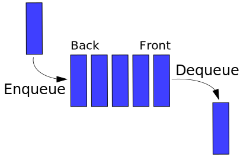
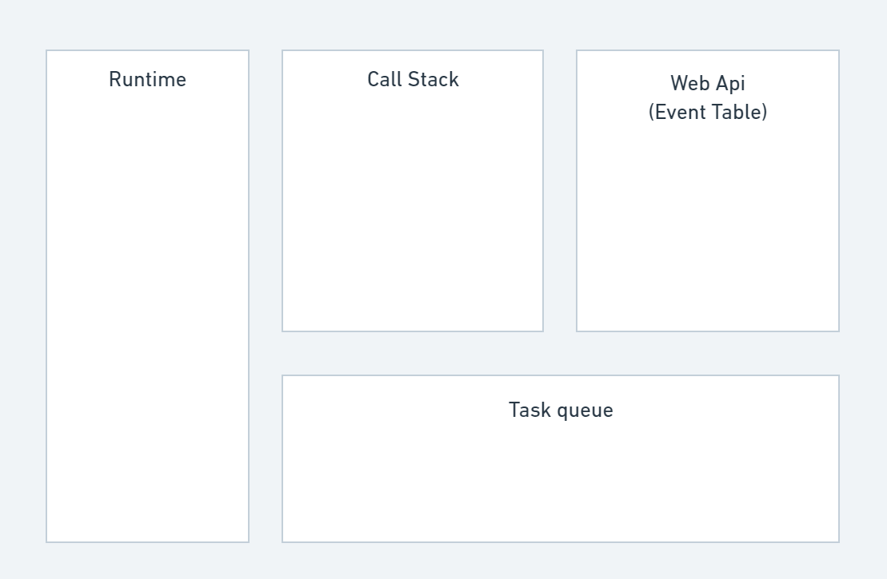

# Event Loop

### 為什麼要用非同步事件：

如果堆疊中有很慢的程式碼，則會造成「阻塞」(blocking)，導致接下來的程式碼沒有辦法被執行，畫面因此而卡住，顯示不完全。

使用非同步的處理方式可以克服阻塞的問題。

了解事件循環的概念之前，需要資料結構中的兩個型態：

(資料結構定義：電腦中儲存、組織資料的方式)

- 堆疊(stack)：資料後進先出(last in first out)，如同罐裝的洋芋片，最後放入的洋芋片必定會在最上面，若我們要拿取下面的洋芋片，則必定要將上面的洋芋片先拿走。


https://upload.wikimedia.org/wikipedia/commons/2/29/Data_stack.svg
- 佇列(queue)：資料先進先出(first in first out)，如同餐廳的候位規則，比較後面來的客人必定要等先到的客人被帶位入座後，才有機會接受服務。



https://upload.wikimedia.org/wikipedia/commons/5/52/Data_Queue.svg


Q：非同步的處理方式是javascript內建的嗎? 

A：不是，Javascript是單線程的程式語言，一次只能做一件事，因此事件循環(event loop)、非同步的web api不存在Javascript中，他們屬於瀏覽器的一部份。

### 一個Javascript檔案被執行時，背後到底發生了什麼事呢?

我們可以用以下這個圖表來解釋：‣



- Runtime：你剛剛寫好的js程式

- Call Stack：用來追蹤 Function 執行狀態的機制。如果執行到某一個函式，便把這個函式添加到堆疊當中的最上方；如果在函式中執行了 return ，則會將此函式從堆疊的最上方中抽離（pop off）。

- Web Api：瀏覽器提供許多不同的API，讓我們能夠同時處理多項任務，此處沒有先來後到的問題，唯有當Web APIs的條件被滿足時，會將等待執行的任務推進至工作佇列(Task Queue)中。

- Task Queue(Callback Queue)：透過 Event Loop 的監控，當執行堆疊裡清空時，才傳入佇列內容中依先進先出排序的任務。

[https://developer.mozilla.org/en-US/docs/Learn/JavaScript/Client-side_web_APIs/Introduction](https://developer.mozilla.org/en-US/docs/Learn/JavaScript/Client-side_web_APIs/Introduction)

[https://developer.mozilla.org/zh-TW/docs/Web/API](https://developer.mozilla.org/zh-TW/docs/Web/API)

### 讓我們用以下這些程式碼範例，在[Loupe](http://latentflip.com/loupe/?code=ZnVuY3Rpb24gQSgpewogIGNvbnNvbGUubG9nKCdBIFN0YXJ0Jyk7CiAgQigpOwogIGNvbnNvbGUubG9nKCdBIEVuZCcpOwp9CgpmdW5jdGlvbiBCKCl7CiAgY29uc29sZS5sb2coJ0IgU3RhcnQnKTsKICBjb25zb2xlLmxvZygnQiBFbmQnKTsKfQoKQSgpOwo%3D!!!PGJ1dHRvbj5DbGljayBtZSE8L2J1dHRvbj4%3D)**中**模擬 event loop 的運作，並觀察console的執行順序：

```javascript
console.log("start!!!");

function init() {
	console.log("function initialize");
}

function fiveSeconds(){
    console.log("5 second");
}

function sixSeconds(){
    console.log("6 second");
}

setTimeout(fiveSeconds, 5000);

init();

setTimeout(sixSeconds, 6000);

console.log("continue 1...");
console.log("continue 2...");
console.log("continue 3...");
console.log("continue 4...");
console.log("continue 5...");
console.log("continue 6...");
console.log("continue 7...");

$.on("button", "click", function () { 
    console.log("button clicked!!!!");
});

console.log("end!!!!");
```

參考資料：

淺談 JavaScript 中的 Event Queue、Event Table、Event Loop 以及 Event Task
https://israynotarray.com/javascript/20211116/1549480598/
