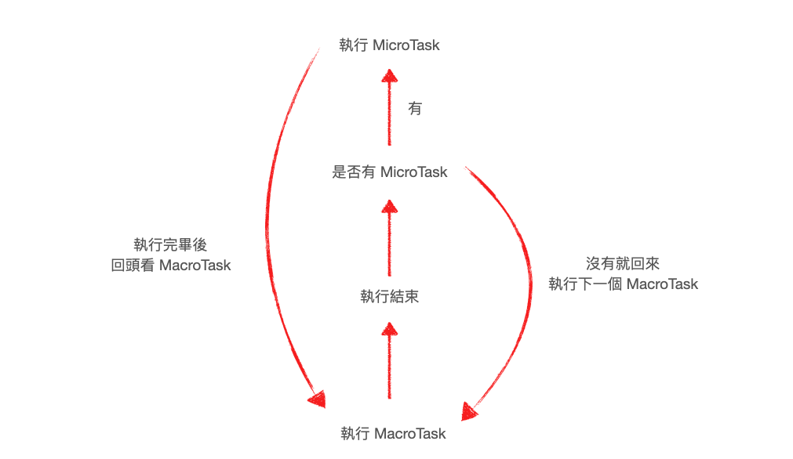

# Macrotask/Microtask

指程式預設的先後順序，Microtask 先執行

| MicroTask 微任務包含       | MacroTask 宏任務包含          |
| -------------------------- | ----------------------------- |
| Promise                    | script(JavaScript 整體程式碼) |
| process.nextTick (Node.js) | setTimeout                    |
| MutationObserver           | setInterval                   |
|                            | setImmediate                  |
|                            | I/O                           |
|                            | UI 互動相關                   |


[https://ithelp.ithome.com.tw/articles/10222737](https://ithelp.ithome.com.tw/articles/10222737)


宏任務與微任務的循環圖：



[https://israynotarray.com/javascript/20211116/1549480598/](https://israynotarray.com/javascript/20211116/1549480598/)

測試範例 - 實際執行看看，並觀察以下各個console的執行先後順序

```
console.log('Start');
setTimeout(() => { console.log('setTimeout') }, 0);
Promise.resolve().then(() => { console.log('Promise') });
console.log('End');
```
